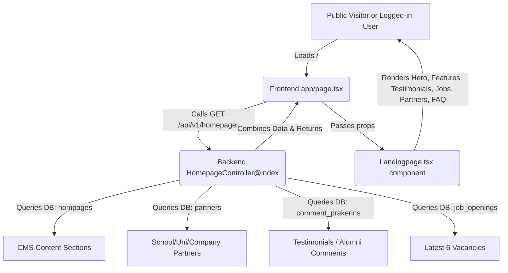

# Audit & System Explanation — Landing Page System

This document contains a comprehensive audit and architectural breakdown of the **Landing Page** features implemented across the `Prakerin` application (Backend and Frontend). It describes the data flows, API endpoints, rendering components, and a critical bug that causes content block failures for logged-in users.

---

## 1. Landing Page Flow & Data Lifecycle

The landing page acts as a public-facing website containing CMS blocks, testimonials (success stories), partner lists, and the latest job openings.



---

## 2. Backend Architecture (`Prakerin-BE`)

Backend landing page endpoints are handled by [HomepageController.php](file:///c:/laragon/www/Prakerin-BE/app/Http/Controllers/HomepageController.php).

### A. Public Data Fetching
*   **Endpoint**: `GET /api/v1/homepages` (`index` method)
*   **Logic**:
    1.  Fetches `Hompage` entries where `name` matches `LIKE %landing%` (defines headers, descriptions, etc.).
    2.  Fetches all `Partner` records.
    3.  Fetches all `CommentPrakerin` records (testimonials).
    4.  Fetches the **latest 6** active and available `JobOpening` records:
        ```php
        JobOpening::with(['company.user', 'company.cityRegency.province', 'field', 'duration'])
            ->where('is_available', true)
            ->where('closing_date', '>=', now()->toDateString())
            ->orderBy('created_at', 'DESC')
            ->limit(6)
            ->get();
        ```
    5.  Formats the CMS entries based on authentication status:
        *   **If Guest**: Returns a flat key-value dictionary (`['name' => 'value']`).
        *   **If Logged In**: Returns the raw Eloquent Collection (`[{id, name, value, ...}]`) for admin editing.

### B. Admin Content Update
*   **Endpoint**: `PATCH /api/v1/homepages` (`update` method)
*   **Middleware**: `auth:sanctum` & `abilities:admin-access`
*   **Logic**: Receives an array of updated block values, maps their IDs, and updates the `hompages` table using a single performant SQL `CASE WHEN` statement:
    ```sql
    UPDATE hompages
    SET value = CASE id
        WHEN 'id-1' THEN 'new-value-1'
        WHEN 'id-2' THEN 'new-value-2'
    END
    WHERE id IN ('id-1', 'id-2')
    ```

---

## 3. Frontend Architecture (`Prakerin-FE`)

### A. Main Entry Page
*   **File**: [page.tsx](file:///c:/laragon/www/Prakerin-FE/src/app/page.tsx)
*   **Logic**: 
    1.  Fetches the Laravel CSRF cookie if not set.
    2.  Hits `GET /api/v1/homepages` asynchronously.
    3.  Prepares `memoizedProps` including CMS content, partner listings, comments, and job openings.
    4.  Passes the `Footer` component as a prop to keep it inside the same scroll-snap section.

### B. Renders & Sections (`Landingpage.tsx`)
*   **File**: [Landingpage.tsx](file:///c:/laragon/www/Prakerin-FE/src/app/Landingpage.tsx)
*   **Structure**:
    1.  **Hero Section** (`#beranda`): Renders `title-landing-1` and a hardcoded description with a link to about-us.
    2.  **Features Section**: Renders `title-landing-2` and three core features (Magang Terverifikasi, Pendampingan Profesional, Bangun Portofolio) along with Lucide icons (CheckCircle2, Users2, Inbox).
    3.  **Success Stories Section** (`#ulasan`): Lists pagination-based testimonial cards. Contains a built-in `ResizeObserver` script to automatically show a "Lihat selengkapnya" link if a comment exceeds 3 lines.
    4.  **Lowongan Magang Section**:
        *   Provides search inputs and filtering dropdowns (Province, City/Regency, Level, Field, Duration).
        *   Fills dropdown options dynamically using `GET /provinces`, `GET /fields`, and `GET /durations`.
        *   Searches cause a route push to `/lowongan?search=...` to load the full job listing client page.
        *   Displays the grid of the 6 latest vacancies.
    5.  **Partners Section** (`#mitra`): Displays school/university and company logo lists inside dynamic tab views with pagination.
    6.  **CTA Section**: Call-to-action button linking to the registration page (`/daftar`).
    7.  **FAQ Section**: Accordion list of frequently asked questions.

---

## 4. Critical Bugs & Deficiencies Found

### 🔴 Critical Bug 1: Authenticated Landing Page Content Failure (`"-"` Display)
*   **File**: [HomepageController.php:L68-75](file:///c:/laragon/www/Prakerin-BE/app/Http/Controllers/HomepageController.php#L68-L75)
*   **Code**:
    ```php
    $formatted = [];
    if ((!Auth::guard('sanctum')->user())) {
        foreach ($data as $item) {
            $formatted[$item->name] = $item->value;
        }
    } else {
        $formatted = $data;
    }
    ```
*   **Why it fails**:
    1.  When a user is **guest** (not logged in), the backend returns a flat dictionary: `{"title-landing-1": "value"}`.
    2.  When a user is **logged in** (any role: student, company, or admin), the backend returns the raw Eloquent Collection array: `[{"id": "...", "name": "title-landing-1", "value": "..."}, ...]`.
    3.  The frontend component `Landingpage.tsx` accesses properties via `homepages?.["title-landing-1"]`.
    4.  Because the returned data is an array of objects for authenticated users, `homepages?.["title-landing-1"]` resolves to `undefined`.
    5.  **Result**: If any logged-in user navigates to the root `/` page, the entire landing page breaks and displays `"-"` instead of titles, features, subtitles, or CTAs.
*   **Fix**:
    Change the backend to always return the flat dictionary key `homepages` to render properly, and pass the raw data in a separate key (e.g. `homepages_raw`) specifically for the admin CMS editor:
    ```php
    return response()->json([
        'data' => [
            'homepages' => $formattedKeyValue,
            'homepages_raw' => $data, // Admin page uses this
            'partners' => $partner,
            ...
        ]
    ]);
    ```

---

## 5. Rich Text Renderer Info

The project uses a component called [RenderBlocks.tsx](file:///c:/laragon/www/Prakerin-FE/src/components/RenderBlocks.tsx) to render WYSIWYG editor blocks (EditorJS).
*   **What it does**: Parses JSON structures containing lists of blocks with types `header` (renders `h1`-`h6`), `paragraph` (renders custom styled HTML paragraphs with auto-detected anchor links), and `list` (ordered/unordered list elements).
*   **Usage**: It is not used on the landing page fields (which are simple flat strings) but is heavily utilized on job details, cover letters, MOU communications, and company descriptions.
