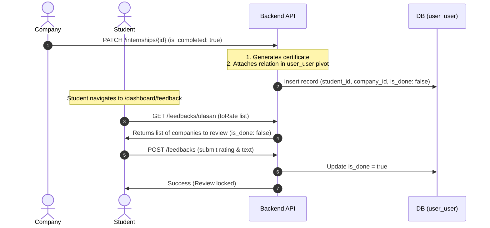

# Audit & System Explanation — Rating & Feedback ("Ulasan") System

This document contains a comprehensive audit and architectural breakdown of the Rating and Feedback (**"Ulasan"**) features implemented across the `Prakerin` application. It details how the system checks internship status, how student and company reviews are linked, the frontend dashboard flows, and critical bugs that need to be addressed.

---

## 1. Feature Overview & Flow

The rating system allows **Students** to review their internship **Companies** (and vice versa in seed data). Reviews consist of a numeric score (1 to 5 stars) and a textual comment. 

The lifecycle of an internship status and feedback triggers follows these stages:



---

## 2. Database Schema & Models

The rating feature relies on three main database tables:

### A. The `feedback` Table
Defined in: [2025_08_28_014547_create_feedback_table.php](file:///c:/laragon/www/Prakerin-BE/database/migrations/2025_08_28_014547_create_feedback_table.php)

Stores the actual rating scores and review text.
*   `id`: Primary key (UUID).
*   `from_user_id`: UUID (FK to `users.id`, cascade on delete). The user giving the feedback.
*   `to_user_id`: UUID (FK to `users.id`, cascade on delete). The user receiving the feedback.
*   `to_type`: Enum (`student`, `company`, `school`, `super_admin`). Role of the recipient.
*   `rating`: TinyInteger (1 to 5).
*   `text`: Text content of the comment.
*   **Unique Index**: `['from_user_id', 'to_user_id']` prevents duplicate reviews between the same two users.

### B. The `user_user` Pivot Table
Defined in: [2025_10_10_031511_create_user_user_table.php](file:///c:/laragon/www/Prakerin-BE/database/migrations/2025_10_10_031511_create_user_user_table.php)

Manages permissions indicating who must rate whom.
*   `user_id`: UUID (FK to `users.id`, representing the reviewer).
*   `related_user_id`: UUID (FK to `users.id`, representing the recipient).
*   `is_done`: Boolean (default `false`). Set to `true` once the feedback is submitted.

### C. The `students` Table
Defined in: [2025_06_24_064921_create_students_table.php](file:///c:/laragon/www/Prakerin-BE/database/migrations/2025_06_24_064921_create_students_table.php)

Tracks student profile-level status.
*   `status`: Enum (`not_started`, `ongoing`, `completed`). Defaults to `not_started`.

---

## 3. Backend Logic Breakdown (`Prakerin-BE`)

Backend endpoints are implemented inside [FeedbackController.php](file:///c:/laragon/www/Prakerin-BE/app/Http/Controllers/FeedbackController.php) and authenticated via Sanctum.

### A. Fetching Users to Rate
*   **Endpoint**: `GET /api/v1/feedbacks/ulasan` (`rate` method)
*   **Logic**: Queries `$request->user()->toRate()` to return related users from the `user_user` pivot table. For students, it returns their host company details, including the `is_done` column.
*   **Relation Definition** in [User.php](file:///c:/laragon/www/Prakerin-BE/app/Models/User.php):
    ```php
    public function toRate() {
        return $this->belongsToMany(User::class, 'user_user', 'user_id', 'related_user_id')
            ->withTimestamps()
            ->withPivot('is_done');
    }
    ```

### B. Submitting a Review
*   **Endpoint**: `POST /api/v1/feedbacks` (`store` method)
*   **Logic**: 
    1. Validates input schema (rating 1-5, recipient exists).
    2. Ensures user is not rating themselves.
    3. Checks if feedback already exists in `feedback` table (throws 400 if true).
    4. Creates `Feedback` record.
    5. Sets `is_done` to `true` in `user_user` pivot table using:
       `auth()->user()->toRate()->updateExistingPivot($data['to_user_id'], ['is_done' => true]);`

### C. Rating Statistics
*   **Endpoint**: `GET /api/v1/feedbacks/rating` (`rating` method)
*   **Logic**: Retrieves overall statistics of feedbacks received by the logged-in user. Returns total rating count, average rating (avg), and individual counts for stars 1 through 5.

### D. Completing an Internship
*   **Endpoint**: `PATCH /api/v1/internships/{id}` (`update` method in [InternshipController.php](file:///c:/laragon/www/Prakerin-BE/app/Http/Controllers/InternshipController.php))
*   **Logic**: Triggered by a company to complete an internship.
    ```php
    if (isset($data['is_completed']) && $data['is_completed'] === true) {
        $certificate = new Certificate();
        $certificate->internship_id = $internship->id;
        $certificate->save();
        auth()->user->rated()->attach($internship->students->user->id); // NOTE: Contains bugs!
    }
    ```
    This inserts a row into the `user_user` table mapping `student_id -> company_id` with `is_done = false`, giving the student permission to rate the company.

---

## 4. Frontend Logic Breakdown (`Prakerin-FE`)

### A. Routing entry point
*   **File**: [page.tsx](file:///c:/laragon/www/Prakerin-FE/src/app/dashboard/feedback/page.tsx)
*   Loads the user's role from cookies.
    *   If `student`, renders the `<StudentFeedback />` component.
    *   Otherwise, renders the `<NonStudentFeedback />` component (used for Companies and Schools).

### B. Student Dashboard Flow (`StudentFeedback.tsx`)
*   **File**: [StudentFeedback.tsx](file:///c:/laragon/www/Prakerin-FE/src/components/roleComponents/StudentFeedback.tsx)
*   Retrieves the list of companies to rate via `GET /feedbacks/ulasan`.
*   Displays each company as a card with a button showing its rating status:
    *   If `is_done` is `true`: Button is styled green (`bg-green-300/30`). Clicking it opens a **read-only modal** showing the rating and comment submitted (fetched via `GET /feedbacks/{id}`).
    *   If `is_done` is `false`: Button is styled orange (`bg-vip/30`). Clicking it opens an **interactive form** allowing the student to select 1-5 stars and write a comment. Submitting calls `POST /feedbacks`.

### C. Industry/School Dashboard Flow (`NonStudentFeedback.tsx`)
*   **File**: [NonStudentFeedback.tsx](file:///c:/laragon/www/Prakerin-FE/src/components/roleComponents/NonStudentFeedback.tsx)
*   Retrieves average rating statistics via `GET /feedbacks/rating`.
*   Displays:
    1.  **Summary Card** with the big average rating number and star breakdown (`<RatingSummaryCompenent />`).
    2.  **Pie Chart** visualizing percentage distribution (`<PieChartCompenent />`).
    3.  **Review List Table**: Intended to show all received feedback entries, but is currently commented out or hidden in the UI.

---

## 5. Critical Bugs & System Discrepancies Found

During this audit, multiple critical bugs and architectural gaps were identified.

### 🔴 Critical Bug 1: Fatal Backend Crash on Completing Internships
*   **File**: [InternshipController.php:L196](file:///c:/laragon/www/Prakerin-BE/app/Http/Controllers/InternshipController.php#L196)
*   **Code**:
    ```php
    auth()->user->rated()->attach($internship->students->user->id);
    ```
*   **Why it fails**:
    1.  `auth()->user` accesses a property on `AuthManager` that does not exist. It must be called as a method: `auth()->user()`.
    2.  The relationship on the `Internship` model is `student` (singular), not `students` (plural). Calling `$internship->students` returns `null`, causing the code to crash with `Attempt to read property "user" on null`.
*   **Fix**:
    ```php
    auth()->user()->rated()->attach($internship->student->user->id);
    ```

---

### 🟡 Bug 2: Unawaited Promise and Missing UI Refresh in Frontend
*   **File**: [StudentFeedback.tsx:L78-103](file:///c:/laragon/www/Prakerin-FE/src/components/roleComponents/StudentFeedback.tsx#L78-L103)
*   **Code**:
    ```typescript
    const response = API.post(
      ENDPOINTS.FEEDBACKS,
      ...
    );
    ```
*   **Why it fails**:
    1.  The `API.post` promise is **not awaited**. If the request fails, the error is ignored, and the UI immediately shows `alertSuccess("")`.
    2.  The `fetchCompany` list is **not called** after submission. The UI continues to show the company as "incomplete" (Amber badge) until the page is manually refreshed.
*   **Fix**:
    ```typescript
    await API.post(ENDPOINTS.FEEDBACKS, { ... });
    fetchCompany(); // Refetch the list to update the badge statuses
    ```

---

### 🟡 Bug 3: Broken Percentage Bar Math
*   **File**: [RatingSummaryCompenent.tsx:L45-47](file:///c:/laragon/www/Prakerin-FE/src/components/RatingSummaryCompenent.tsx#L45-L47)
*   **Code**:
    ```typescript
    const value = data[`rating_${star}` as keyof RatingSummary];
    const count = value;
    const percentage = value ? (count / value) * 100 : 0;
    ```
*   **Why it fails**:
    `count` and `value` are the same variable. Therefore, `count / value` is always `1`. The progress bar will display **100% width** for every star row that has at least one rating, regardless of the relative distribution.
*   **Fix**:
    ```typescript
    const count = data[`rating_${star}` as keyof RatingSummary];
    const percentage = data.rating_count > 0 ? (count / data.rating_count) * 100 : 0;
    ```

---

### ⚠️ Discrepancy 4: Student Status Field is Inconsistent
*   **Context**: 
    *   When the company accepts an application, it automatically updates the student's status to `"ongoing"`.
    *   However, when the company marks the internship as completed (`is_completed = true`), the student's status inside the `students` table is **not updated** to `"completed"`. It remains `"ongoing"` unless updated manually or via seeds.
*   **Solution**: In [InternshipController.php](file:///c:/laragon/www/Prakerin-BE/app/Http/Controllers/InternshipController.php) inside the `is_completed` conditional, also update the student status:
    ```php
    $internship->student->update(['status' => 'completed']);
    ```

---

### ⚠️ Discrepancy 5: Reviews List is Hidden for Companies and Schools
*   **Context**: In [NonStudentFeedback.tsx](file:///c:/laragon/www/Prakerin-FE/src/components/roleComponents/NonStudentFeedback.tsx), the table rendering the review list and comments is commented out/empty. Companies can see their overall average star count, but they have no way to read the written feedback comments left by students.
